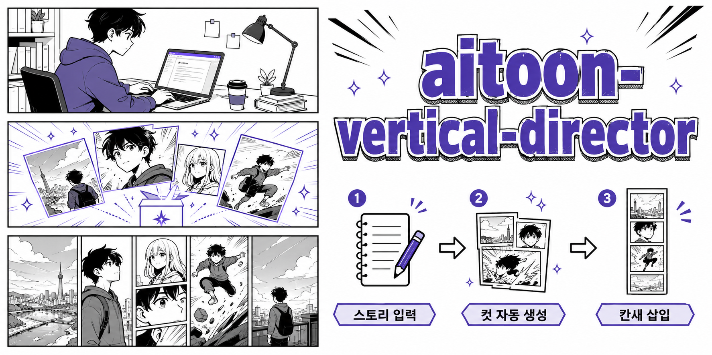

# aitoon-vertical-director

> Claude Cowork용 세로 스크롤 웹툰 자동화 스킬 (Track B)

스토리를 넣으면 세로 웹툰용 컷 프롬프트를 자동으로 만들어주고, 이미지가 나오면 칸새 삽입부터 합본까지 처리합니다.

---

## 전체 흐름

```
스토리 입력
    ↓
[스킬] 씬·컷 구성 + GPT 복붙 프롬프트 생성 + 칸새 간격 가이드
    ↓
[유저] GPT(나노바나나)에 복붙 → 컷 이미지 생성 → 작업 폴더에 저장
    ↓
[스킬] 칸새 자동 삽입 → 장별 편집본 생성 (gutter_inserter.py)
    ↓
[유저] 말풍선·효과음 수동 편집
    ↓
[스킬] 장별 이미지 세로 합본 (merge_jang.py)
```

---

## 특징

- 한 장(9:16)에 컷 2~3개를 세로로 묶어 GPT에서 뽑는 프롬프트 자동 생성
- 미드저니 sref 스타일 경로 / GPT 단독 경로 선택 지원
- seam carving 기반 칸새 자동 삽입 (`gutter_inserter.py`)
- 편집 완료 후 세로 합본 자동화 (`merge_jang.py`)
- 클린 원고 원칙 — 칸새·말풍선·SFX는 이미지에 그리지 않음

---

## 설치

Claude Cowork 데스크탑 앱에서 `.skill` 파일을 설치합니다.

1. [Releases](../../releases)에서 최신 `.skill` 파일을 다운로드
2. Cowork 앱 → Settings → Capabilities → 스킬 설치
3. 설치 후 대화에서 "세로 웹툰 만들어줘"로 시작

---

## 사용 방법

### 스킬 시작

```
"이 스토리로 세로 웹툰 만들어줘"
"세로 스크롤 웹툰 프롬프트 뽑아줘"
"aitoon-vertical 시작"
```

스킬이 시작되면 전체 흐름을 안내하고, 미드저니 sref 스타일이 있는지 물어봅니다.

### 경로 선택

| 경로 | 설명 |
|------|------|
| 미드저니 경로 | sref 그리드 이미지 분석 → MJ로 캐릭터 시트 생성 → GPT 컷 생성 |
| GPT 경로 | GPT로 캐릭터 시트 생성 후 컷 생성까지 GPT 단독 진행 |

### 산출물

- 캐릭터 ref 프롬프트 (GPT 복붙용)
- 장별 컷 생성 프롬프트 (GPT 복붙용, 클린 원고)
- 칸새 간격 가이드 (`1컷-(700px)-2컷-(1200px)-3컷` 형식)
- 이미지 업로드 시 이상한 컷 진단 + 프롬프트 수정 (Step 7)

---

## 스크립트

### gutter_inserter.py — 칸새 자동 삽입

컷 이미지에 칸새를 자동 삽입해 장별 편집본을 만듭니다.  
seam carving으로 컷 경계를 찾아 칸새를 정밀하게 삽입합니다.

```bash
python scripts/gutter_inserter.py \
  --input ep08-1.png ep08-2.png ep08-3.png \
  --cuts 3 3 2 \
  --cut-gaps 700,1200 700,900 600 \
  --jang-gaps 300 300 \
  --margin-top 80 \
  --margin-bottom 80 \
  --out ./output/
```

```bash
python scripts/gutter_inserter.py --help
```

**주요 옵션**

| 옵션 | 설명 |
|------|------|
| `--input` | 원본 컷 이미지 파일 목록 |
| `--cuts` | 각 장의 컷 개수 (예: `3 2 3`) |
| `--cut-gaps` | 장별 컷 사이 칸새 픽셀 (예: `700,1200 600`) |
| `--jang-gaps` | 장과 장 사이 칸새 픽셀 (장 수 - 1개) |
| `--margin-top` | 첫 장 상단 여백 픽셀 |
| `--margin-bottom` | 마지막 장 하단 여백 픽셀 |
| `--out` | 출력 폴더 경로 |

칸새 값은 스킬의 Step 5 칸새 간격 가이드에서 그대로 옮겨 사용합니다.

---

### merge_jang.py — 세로 합본

말풍선·효과음 편집이 끝난 장별 이미지를 세로로 이어붙여 합본 PNG를 만듭니다.  
칸새는 gutter_inserter가 이미 절반씩 넣어두었으므로 단순 concat으로 맞물립니다.

```bash
# 폴더 자동 수집 (파일명에 'edit' 포함, 자연 정렬)
python scripts/merge_jang.py --input ./ep08/ --out ep08_합본.png

# 파일 직접 지정 (순서 = 입력 순서)
python scripts/merge_jang.py ep08-1-edit.png ep08-2-edit.png ep08-3-edit.png --out ep08_합본.png
```

```bash
python scripts/merge_jang.py --help
```

---

## 요구사항

스크립트 실행에 필요한 Python 패키지:

```bash
pip install pillow numpy scipy
```

---

## 범위

**이 스킬이 하는 것:**  
씬·컷 구성 / 세로 연출 판단 / GPT 복붙 프롬프트 생성 / 칸새 간격 가이드 / 칸새 자동 삽입 / 세로 합본 / 이상한 컷 진단 및 프롬프트 수정

**이 스킬이 하지 않는 것:**  
이미지 직접 생성 / 말풍선·SFX 합성 / SVG 레이아웃·뷰어 / 페이지형 가로 그리드 컷만화
